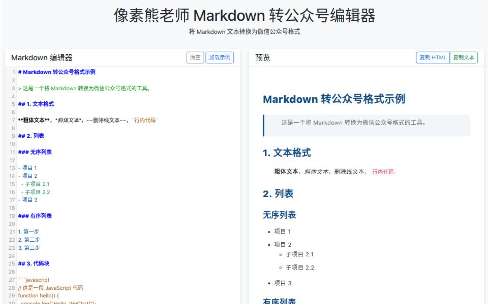

# Markdown 转公众号编辑器

一个简单的 Markdown 转微信公众号格式的工具，使用 HTML5 + JavaScript 实现。

## 功能特点

- 实时预览 Markdown 转换效果
- 支持自定义样式（字体、字号、颜色、行高等）
- 支持首行缩进设置
- 支持复制 HTML 或纯文本到剪贴板
- 支持代码高亮
- 支持任务列表
- 简单支持数学公式（仅作为演示，实际使用建议集成 MathJax 或 KaTeX）

## 使用方法

1. 克隆或下载本仓库
2. 在浏览器中打开 `index.html` 文件
3. 在左侧编辑器中输入 Markdown 文本，右侧会实时预览转换效果
4. 可以通过下方的样式设置面板调整预览效果
5. 点击"复制 HTML"或"复制文本"按钮，将内容复制到剪贴板
6. 在微信公众号编辑器中粘贴内容

## 支持的 Markdown 语法

- 标题（H1-H6）
- 粗体、斜体、删除线
- 有序列表和无序列表
- 代码块和行内代码
- 表格
- 图片
- 链接
- 引用
- 分割线
- 任务列表
- 简单数学公式

## 技术栈

- HTML5
- CSS3
- JavaScript
- [CodeMirror](https://codemirror.net/) - 代码编辑器
- [Marked](https://marked.js.org/) - Markdown 解析器
- [highlight.js](https://highlightjs.org/) - 代码高亮
- [Bootstrap](https://getbootstrap.com/) - UI 框架

## 本地开发

直接在浏览器中打开 `index.html` 文件即可进行开发和测试。

## 致谢

本项目参考了 [Doocs/md](https://github.com/doocs/md) 项目的实现。

## 许可证

MIT 